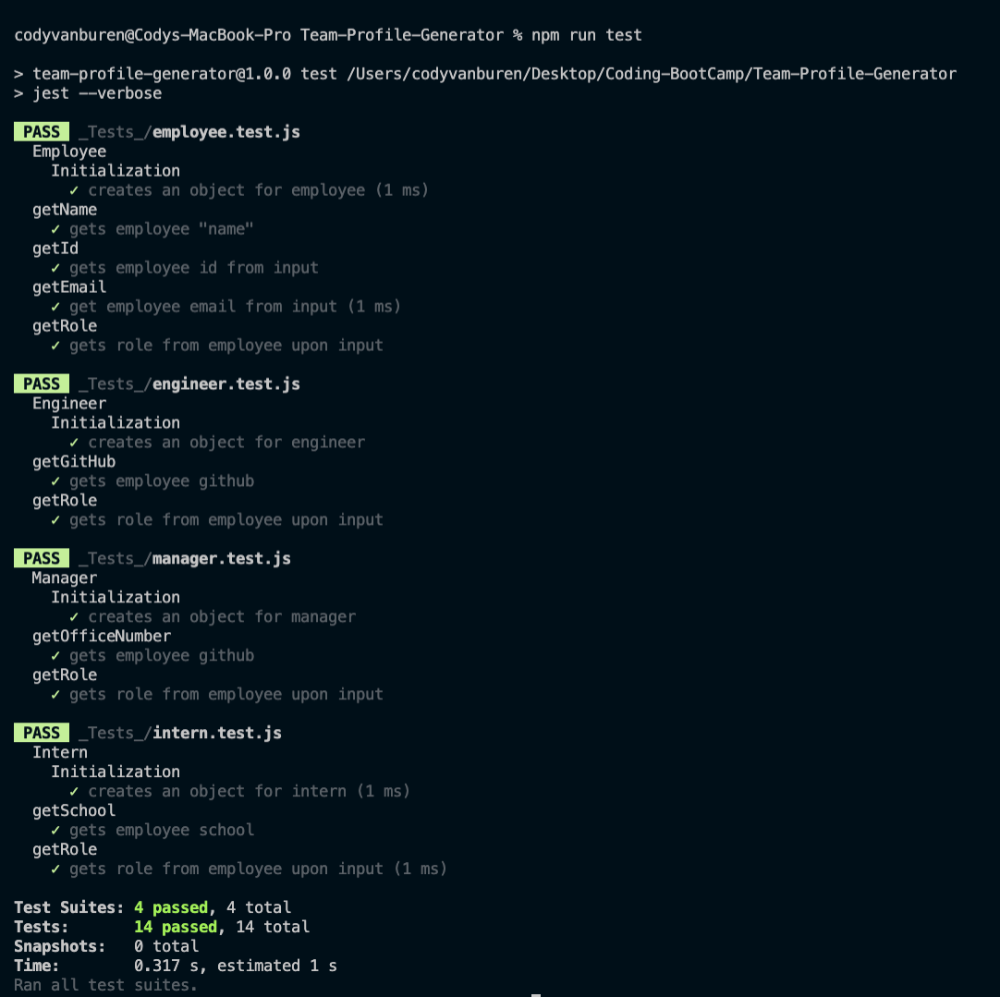
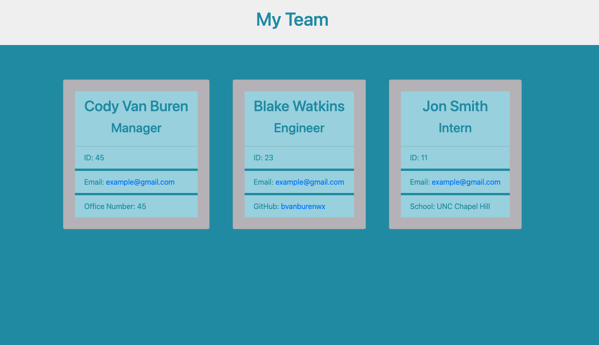

# Team-Profile-Generator

---
[](https://opensource.org/licenses/MIT)

## Table of Contents:
- [Description](#description)
- [Installation](#installation)
- [Technologies](#technologies)
- [Usage](#usage)
- [Testing](#testing)
- [Screenshots](#screenshots)
- [Additional-Info](#additional-info)

---

## Description:

This application is a team profile builder. The user will run the program and be asked a series of questions on who will be the manager of the team. The user will then be asked whether they would like to add an engineer or an intern. Once the user chooses intern or manager, another series of questions will follow. The user can then add as many interns and engineers as they would like. Once the user chooses that they would no longer like to add more employees, the information provided for each added employee will be dynamically updated to the team.html file. 

---

## Technologies:
```
- Javascript
- Node
- Jest
- Inquirer
```

---

## Installation: 
```
Clone the repo and then run npm install in an integrated terminal. Then run node index.js
``` 

---

## Usage: 

This application has built in classes in order to help the user build their team of employees including: manager, intern, and engineers. The applicant just has to answer the questions accordingly and their information will dynamically be reproduced on team cards in the team.html file. 

---

## Testing:

This application feautures several tests to test the created class employee and the sub-classes of engineer, manager, and intern. These test are run using jest and all the tests have passed for this application. 

## Screenshots:





---

## Additional Info:
- Github: [bvanburenwx](https://github.com/bvanburenwx)
- Email: bvanburenwx@gmail.com
- Application Walkthrough: [Walkthrough](https://drive.google.com/file/d/1vBfgUD5Hbawpb_TvKDgedVHfqVvh4-RS/view)
